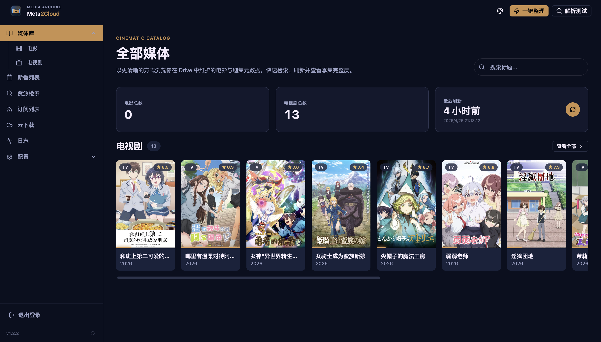
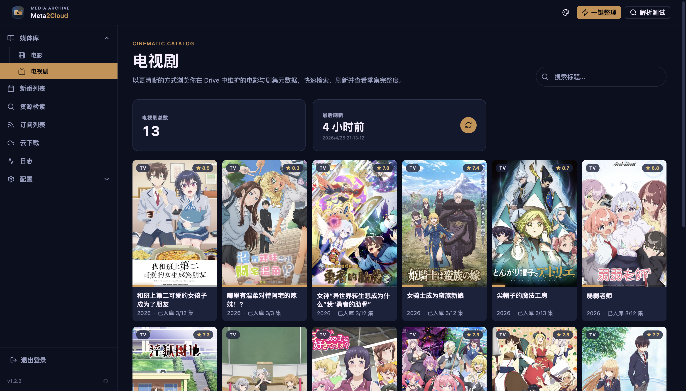
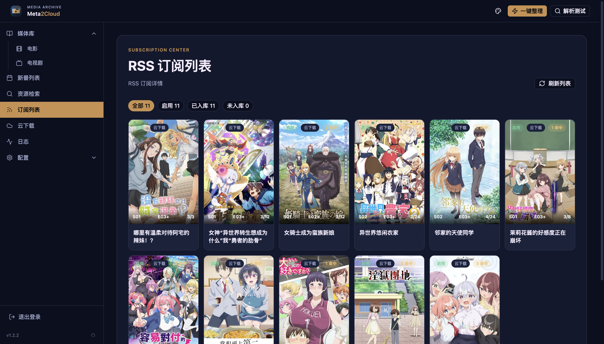
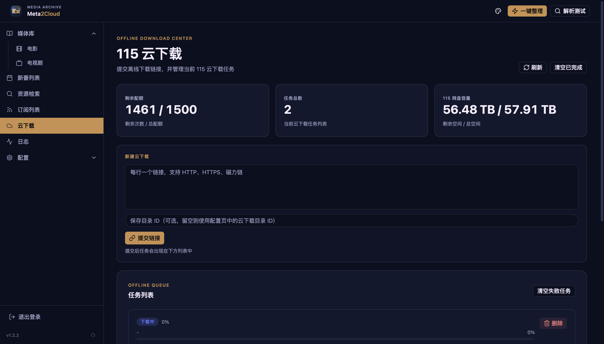
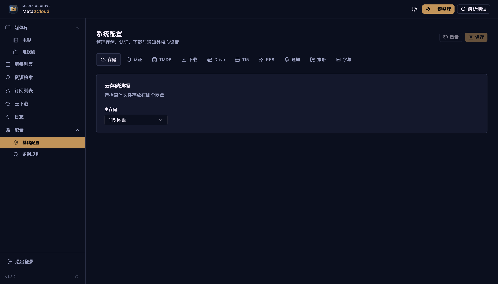

# Meta2Cloud

网盘媒体库自动整理工具，配合 Infuse、爆米花等播放器使用。

      

## 为什么用这个？

**无需媒体服务器，也能有刮削好的媒体库体验。**

如果你：
- 用网盘存电影和剧集
- 不想搭建 Plex/Emby/Jellyfin 服务器
- 用 Infuse、爆米花等播放器直连网盘观看

那 Meta2Cloud 可以帮你：
- 自动识别文件名，整理成规范的目录结构
- 自动查询 TMDB，生成 NFO 文件
- 自动下载海报和背景图
- Infuse/爆米花读取后直接展示海报、简介、演员信息

## 推荐播放器

这些播放器可以直接连接网盘，读取 Meta2Cloud 生成的 NFO 和海报：

| 播放器 | 平台 | 支持网盘 | 特点 |
|--------|------|----------|------|
| [Infuse](https://firecore.com/infuse) | iOS / macOS / Apple TV | Google Drive、115 | Apple 生态体验最佳 |
| [网易爆米花](https://bmh.163.com/) | 全平台 | 115、阿里云盘 | 对国内网盘支持好 |
| [VidHub](https://vidhub.okaapps.com/) | 全平台 | Google Drive、115 等 | 免费、跨平台 |
| [nPlayer](https://nplayer.com/) | iOS / macOS / Android | Google Drive 等 | 功能全面 |

## 功能

- 📝 **解析文件名** — 自动识别片名、年份、季集号
- 🔍 **查询 TMDB** — 获取中文片名、简介、演员、评分
- 📄 **生成 NFO** — Infuse/爆米花可直接读取
- 🖼️ **下载海报** — poster、fanart、季封面
- 📁 **整理目录** — 符合播放器识别规范
- 🔄 **移动文件** — 自动重命名
- 📝 **字幕整理** — 自动跟随视频移动
- 📲 **Telegram 通知** — 整理完成推送

## 整理效果

**整理前：**
```
/下载/
  ├── [字幕组]Breaking.Bad.S01E03.1080p.BluRay.x264.mkv
  ├── 绝命毒师.第一季第4集.mp4
  └── inception.2010.1080p.bluray.mkv
```

**整理后：**
```
/媒体库/
  ├── 绝命毒师 (2008)/
  │   ├── tvshow.nfo
  │   ├── poster.jpg
  │   ├── fanart.jpg
  │   └── Season 01/
  │       ├── 绝命毒师 - S01E03.mkv
  │       ├── 绝命毒师 - S01E03.nfo
  │       └── ...
  └── 盗梦空间 (2010)/
      ├── 盗梦空间 (2010).mkv
      ├── 盗梦空间 (2010).nfo
      ├── poster.jpg
      └── fanart.jpg
```

## 支持的网盘

- Google Drive
- 115 网盘

## 快速开始

### Docker 部署（推荐）

```bash
# 创建配置目录
mkdir -p meta2cloud-config

# 复制配置文件模板
cp config/config.example.yaml meta2cloud-config/config.yaml
cp config/parser-rules.example.yaml meta2cloud-config/parser-rules.yaml
```

创建 `docker-compose.yml`：

```yaml
services:
  meta2cloud:
    image: benz1/meta2cloud:latest
    container_name: meta2cloud
    environment:
      - TZ=Asia/Shanghai
    volumes:
      - ./meta2cloud-config:/app/config
    network_mode: host
    restart: unless-stopped
```

启动：

```bash
docker compose up -d
```

访问 `http://localhost:38765` 打开 Web UI。

### 本地运行

后端：
```bash
uv sync
uv run uvicorn webui.app:app --host 0.0.0.0 --port 38765 --reload
```

前端开发（可选）：
```bash
cd frontend
npm install
npm run dev   # http://localhost:5173，自动代理 API 到后端
```

直接运行整理（无需启动 Web UI）：
```bash
uv run python -m core --dry-run  # 预览模式
uv run python -m core            # 正式整理
```

## Web UI 截图








## 配置说明

详细配置说明见 [config/config.example.yaml](config/config.example.yaml)。

除必填配置外，其他配置可在 Web UI 中配置。

### 必填配置

```yaml
# 使用哪个网盘
storage:
  primary: "google_drive"  # 或 pan115

# Web UI 登录
webui:
  username: "admin"
  password: "你的密码"

# TMDB API（从 https://www.themoviedb.org/settings/api 获取）
tmdb:
  api_key: "你的 TMDB API Key"
  language: "zh-CN"
```

### Google Drive 配置

1. 从 [Google Cloud Console](https://console.cloud.google.com/) 创建 OAuth 客户端 ID（桌面应用）
2. 下载凭据文件保存为 `meta2cloud-config/credentials.json`
3. 首次运行时会引导你授权，生成 `token.json`

```yaml
drive:
  scan_folder_id: "待整理目录 ID"
  root_folder_id: "媒体库根目录 ID"
  movie_root_id: "电影目录 ID"   # 可选
  tv_root_id: "剧集目录 ID"      # 可选
```

目录 ID 从浏览器地址栏获取：`https://drive.google.com/drive/folders/这里是ID`

### 115 网盘配置

```yaml
storage:
  primary: "pan115"

u115:
  client_id: "你的 client_id"   # 从 115 开放平台获取，必填
  download_folder_id: "云下载目录 ID"
  root_folder_id: "媒体库根目录 ID"
  movie_root_id: "电影目录 ID"  # 可选
  tv_root_id: "剧集目录 ID"     # 可选
```

目录 ID 从浏览器地址栏的 `cid` 参数获取。

首次使用时，通过 Web UI 扫码授权。

## 高级功能

### Aria2 集成

配置 Aria2 RPC 后，Web UI 可查看下载状态。

```yaml
aria2:
  enabled: true
  host: "127.0.0.1"
  port: 6800
  secret: "你的 RPC 密钥"
```

### 自动触发整理

下载完成后自动触发整理，配合 Aria2 或 rclone 使用：

```bash
curl -X POST http://localhost:38765/trigger \
  -H "Content-Type: application/json" \
  -H "X-Webhook-Secret: 你的密钥"
```

支持防抖，批量下载时合并为一次整理。

### Telegram 通知

整理完成自动推送通知：

```yaml
telegram:
  bot_token: "从 @BotFather 获取"
  chat_id: "你的 Chat ID"
```

### RSS 订阅

支持 Mikan Project 动漫订阅，自动下载新番。

## 常见问题

**会删除原文件吗？**

整理是"移动"到目标目录，不是删除。建议先用 `--dry-run` 预览。

**文件名识别错误怎么办？**

用 Web UI 的"解析测试"查看识别结果，可以在 `parser-rules.yaml` 中添加自定义识别词。

**TMDB 找不到怎么办？**

通常是文件名太乱或别名太多。尝试修改文件名后重新整理。

**只想整理不下载海报？**

```bash
python -m core --no-images
```

**只想预览不实际操作？**

```bash
python -m core --dry-run
```

## 致谢

识别词部分参考 [MoviePilot](https://github.com/jxxghp/MoviePilot) 项目。

## 许可证

[GPL v3](LICENSE)
